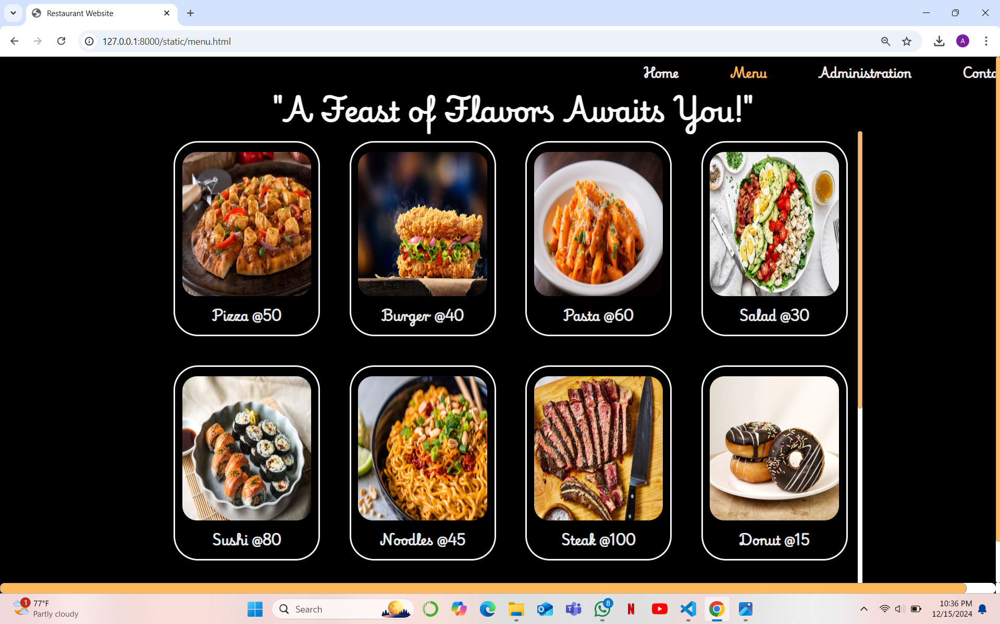

re# Ex.07 Restaurant Website
## Date:15/12/2024

## AIM:
To develop a static Restaurant website to display the food items and services provided by them.

## DESIGN STEPS:

### Step 1:
Requirement collection.

### Step 2:
Creating the layout using HTML and CSS.

### Step 3:
Updating the sample content.

### Step 4:
Choose the appropriate style and color scheme.

### Step 5:
Validate the layout in various browsers.

### Step 6:
Validate the HTML code.

### Step 7:
Publish the website in the given URL.

## PROGRAM:
```
home.html

<!DOCTYPE html>
<html lang="en">

<head>
    <meta charset="UTF-8">
    <meta name="viewport" content="width=device-width">
    <title>Restaurant Website</title>
    <link rel="stylesheet" href="styles.css">
</head>

<body>
    <section id="home" class="common">
        <nav>
            <h3 style="color: rgb(255, 185, 94);">Home</h3>
            <a href="menu.html">

                <h3>Menu</h3>
            </a>
            <a href="admin.html">
                <h3>Administration</h3>
            </a>
            <a href="contact.html">
                <h3>Contact us</h3>
            </a>


        </nav>
        <div class="banner">
            <h1>Welcome To BHAVI's </h1>
            <h1>Kitchen</h1>
            <h4>"Where Every Bite Tells a Story!"</h4>
        </div>


    </section>

</body>

</html>

menu.html

<!DOCTYPE html>
<html lang="en">

<head>
    <meta charset="UTF-8">
    <meta name="viewport" content="width=device-width, initial-scale=1.0">
    <title>Restaurant Website</title>
    <link rel="stylesheet" href="styles.css">
</head>

<body>
    <section id="menu" class="common">
        <nav>
            <a href="home.html">
                <h3>Home</h3>
            </a>
            <h3 style="color: rgb(255, 185, 94);">Menu</h3>
            <a href="admin.html">
                <h3>Administration</h3>
            </a>
            <a href="contact.html">
                <h3>Contact us</h3>
            </a>

        </nav>
        <h1>"A Feast of Flavors Awaits You!" </h1>
        <div id="menuContainer">


        </div>


    </section>
    <script>
        const menuItems = [
            {
                imageSrc: 'pizz.webp',
                title: 'Pizza',
                price: 50,
            },
            {
                imageSrc: 'burger.jpg',
                title: 'Burger',
                price: 40,
            },
            {
                imageSrc: 'pasta.webp',
                title: 'Pasta',
                price: 60,
            },
            {
                imageSrc: 'salad.webp',
                title: 'Salad',
                price: 30,
            },
            {
                imageSrc: 'sushi.webp',
                title: 'Sushi',
                price: 80,
            },

            {
                imageSrc: 'noodles.webp',
                title: 'Noodles',
                price: 45,
            },
            {
                imageSrc: 'steak.avif',
                title: 'Steak',
                price: 100,
            },

            {
                imageSrc: 'donut.webp',
                title: 'Donut',
                price: 15,
            },
            {
                imageSrc: 'frenchfries.jpg',
                title: 'FrenchFries',
                price: 40,
            },
            {
                imageSrc: 'wrap.jpg',
                title: 'Wrap',
                price: 60,
            },
            {
                imageSrc: 'frankie.jpg',
                title: 'Frankie',
                price: 80,
            },
            {
                imageSrc: 'muttonbiriyani.jpg',
                title: 'Briyani',
                price: 130,
            },
            {
                imageSrc: 'kfc.jpeg',
                title: 'kFC FriedChicken',
                price: 100,
            },

            {
                imageSrc: 'tandoori.webp',
                title: 'Tandoori',
                price: 450,
            },
            {
                imageSrc: 'bbq.webp',
                title: 'BBQ',
                price: 100,
            },

            {
                imageSrc: 'grill.jpg',
                title: 'Grill',
                price: 15,
            },
        ];

        menuItems.forEach(createFoodItem);


        function createFoodItem(item) {
            // Create the main card div
            const menuCard = document.createElement('div');
            menuCard.classList.add('menuCard');

            // Create and set the image element
            const img = document.createElement('img');
            img.src = item.imageSrc;
            img.alt = item.title;

            // Create the content div
            const content = document.createElement('div');
            content.classList.add('content');

            // Create and set the title element
            const heading = document.createElement('h2');
            heading.textContent = `${item.title} @${item.price}`;

            // Append the heading to content div
            content.appendChild(heading);

            // Append the image and content div to the card
            menuCard.appendChild(img);
            menuCard.appendChild(content);

            // Append the card to the menu container
            document.getElementById('menuContainer').appendChild(menuCard);
        }

    </script>

</body>

</html>

admin.html

<!DOCTYPE html>
<html lang="en">

<head>
    <meta charset="UTF-8">
    <meta name="viewport" content="width=device-width, initial-scale=1.0">
    <title>Admin</title>
    <link rel="stylesheet" href="styles.css">
</head>

<body>
    <section id="admin" class="common">
        <nav>
            <a href="home.html">
                <h3>Home</h3>
            </a>
            <a href="menu.html">
                <h3>Menu</h3>
            </a>
            <h3 style="color: rgb(255, 185, 94)">Administration</h3>
            <a href="contact.html">
                <h3>Contact us</h3>
            </a>

        </nav>
        <h1>"Meet the Minds Behind the Magic!"</h1>
        <div id="menuContainer" style="overflow-y: unset;">


        </div>

        <script>


            function createPersonCard(person) {
                const peopleCard = document.createElement('div');
                peopleCard.classList.add('people');

                const img = document.createElement('img');
                img.src = person.imageSrc;
                img.alt = person.name;

                const nameHeading = document.createElement('h2');
                nameHeading.style.color = 'rgb(255, 185, 94)';
                nameHeading.textContent = person.name;

                const designationParagraph = document.createElement('p');
                designationParagraph.textContent = person.designation;

                peopleCard.appendChild(img);
                peopleCard.appendChild(nameHeading);
                peopleCard.appendChild(designationParagraph);

                document.getElementById('menuContainer').appendChild(peopleCard);
            }
            const people = [
                {
                    imageSrc: 'ch6.jpg',
                    name: 'AVINESH THAlA',
                    designation: 'CEO',
                },
                {
                    imageSrc: 'ch2.jpeg',
                    name: 'MASTER',
                    designation: 'Operations',
                },
                {
                    imageSrc: 'ch.jpeg',
                    name: 'MICHAEL RAYAPPAN',
                    designation: 'Master Cheif',
                },
                {
                    imageSrc: 'ch3.webp',
                    name: 'JOSEPH VIJAY',
                    designation: 'Associate Chief',
                },

                {
                    imageSrc: 'ch4.avif',
                    name: 'KANNAMA',
                    designation: 'Waiter',
                },
                {
                    imageSrc: 'ch5.jpg',
                    name: 'muniyamma',
                    designation: 'Waiter',
                },
            ];
            people.forEach(createPersonCard)
        </script>


</body>

</html>

contact.html

<!DOCTYPE html>
<html lang="en">

<head>
    <meta charset="UTF-8">
    <meta name="viewport" content="width=device-width, initial-scale=1.0">
    <title>Contact Us</title>
    <link rel="stylesheet" href="styles.css">
</head>

<body>
    <div class="container">
        <section id="admin" class="common">
            <nav>
                <a href="home.html">
                    <h3>Home</h3>
                </a>
                <a href="menu.html">
                    <h3>Menu</h3>
                </a>
                <a href="admin.html">
                    <h3>Admin</h3>
                </a>
                <h3 style="color: rgb(255, 185, 94)">Contact us</h3>

            </nav>
            <h1>Contact Us</h1>
            <div id="contact">
                <h2>BHAVI's kitchen</h2>
                <h3>no:3/401,5th main road , Bus Stand , Tindivanam 604001</h3>
                <h4>6374111640</h4>
                <h4>bhaviavinesh@gmail.com</h4>

            </div>
        </section>

    </div>
</body>

</html>

styles.css

/* Font Family */
@import url('https://fonts.googleapis.com/css2?family=Playwrite+HU:wght@100..400&family=Sora:wght@100..800&display=swap');

* {
    margin: 0;
    padding: 0;
    box-sizing: border-box;
    font-family: "Playwrite HU", cursive;

}

/* Body and font styling */
body {
    font-family: Arial, sans-serif;
    line-height: 1.6;
    background-color: rgb(0, 0, 0) ;
    
}

/* Header and Navigation Menu */
header {
    background-color: rgb(0, 0, 0);
    padding: 1rem;
    position: fixed;
}

header nav ul {
    list-style: none;
    display: flex;
    justify-content: center;
}

header nav ul li {
    margin: 0 20px;
}

header nav ul li a {
    color: rgb(251, 251, 251);
    text-decoration: none;
    font-weight: bold;
    font-size: 18px;
}
.common{
    display: flex;
    flex-direction: column;
    justify-content: flex-start;
    align-items: center;
    font-family: "Playwrite HU", cursive;
}

#home{
    width: 2100px;
    height: 1170px;
    background:url(bg.jpg);
    background-size: cover; /* Ensures the image covers the entire container */
    background-position: center; /* Keeps the image centered */
    background-repeat: no-repeat;
    background-color: rgb(0, 0, 0);
    
}

.banner{
    width: 80%;
    height: 40%;
    color: #efecec;
    font-size: 90px;
    display: flex;
    flex-direction: column;
    align-items: center;
}
.banner h4{
    position: absolute;
    top: 91%;
    font-size: 60px;
    color: rgb(255, 185, 94);
}
nav{
    width: 100%;
    display: flex;
    height: 10%;
    color: #fdfbfb;
    justify-content: flex-end;
    gap: 5%;
    align-items: center;
    font-size: 20px;
    
}
a{
    text-decoration: none;
    color: #f5eded;
}

/* Menu */
#menu{
    width: 2100px;
    height: 1170px;
    color: #fafafa;
}
#menu h1{
    font-size: 55px;
}

.menuCard{
    width: 300px;
    height: 400px;
    border-radius: 50px;
    display: flex;
    flex-direction: column;
    justify-content: space-evenly;
    align-items: center;
    border: 4px solid #f3f3f3;
    
}
#menuContainer {
    display: grid;
    grid-template-columns: repeat(4, 1fr); /* Four equal-width columns */
    gap: 60px; /* Space between cards */
    padding: 20px;
    justify-content: center; /* Centers the grid horizontally */
    align-items: start; /* Aligns items to the top */
    overflow-y: scroll;
}
.menuCard img{
    width: 90%;
    height: 75%;
    border-radius: 30px;
}
.content{
    width: 90%;
    display: flex;
    flex-direction: column;
    align-items: center;
    justify-content: flex-start;
}
.content h2{
    font-size: 25px;
    color: rgb(235, 235, 235);

}
/* Administration */
#administration h1{
    font-size: 50px;
    margin-top: 30px;
    color: #fdfafa;

}
.people{
    width: 300px;
    height: 400px;
    border-radius: 30px;
    border: 4px solid #000000;
    display: flex;
    flex-direction: column;
    align-items: center;
    justify-content: space-evenly;
    color: #ffffff;
}
.people img{
    width: 90%;
    height: 60%;

}

/* Scroll Bar */
::-webkit-scrollbar {
    width: 10px; /* Width of the scrollbar */
}

::-webkit-scrollbar-track {
    background: #ffffff; /* Background color of the track */
    border-radius: 10px; /* Rounded corners for the track */
}

::-webkit-scrollbar-thumb {
    background: rgb(255, 185, 94); /* Color of the scrollbar handle */
    border-radius: 10px; /* Rounded corners for the handle */
    border: 2px solid rgb(168, 147, 147); /* Adds space around the handle */
}

::-webkit-scrollbar-thumb:hover {
    background: #000000; /* Darker color on hover for the handle */
}
#contact{
    width: 1000px;
    height: 500px;
    margin-top: 100px;
    border-radius: 30px;
    color: #ffffff;
    display: flex;
    flex-direction: column;
    align-items: center;
    justify-content: center;
    gap: 20px;
}

```

## OUTPUT:




## RESULT:
The program for designing software company website using HTML and CSS is completed successfully.
